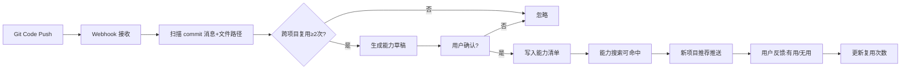
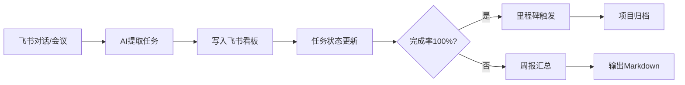

# 项目智能管家（Hermes Agent）— FPA 功能点分析报告

> 基于 PRD V1.0 的功能点分析

---

## 第一部分：核心实体与模块映射表

| 核心实体 | 所属业务模块 | 说明 |
|:---|:---|:------|
| 项目 (Project) | 项目管理 | 受管的项目，含编号、名称、状态、技术栈、路径 |
| 任务 (Task) | 项目管理 | 从对话/会议/代码中提取的任务，含状态/优先级/关联项目 |
| 会议记录 (Meeting) | 项目管理 | 飞书会议录音/文字记录，原始素材 |
| 周报 (WeeklyReport) | 项目管理 | 每周自动生成的汇总报告 |
| 原子能力 (Capability) | 能力管理 | 可复用的代码/算法/预设，含ID/描述/调用方式/来源项目 |
| 能力版本 (CapVersion) | 能力管理 | 原子能力的历史版本记录 |
| 能力调用记录 (CapUsage) | 能力管理 | 每次能力的使用记录，含项目/时间/评价 |
| 文档关联 (DocLink) | 知识库维护 | 飞书文档与代码/能力的关联关系 |
| 操作日志 (AuditLog) | 系统基础 | 所有自动化操作的操作记录，支持回滚 |

## 第二部分：功能点清单（按模块分组）

### 模块 A：项目管理

| 功能点名称 | 编号 | 操作类型 | 涉及核心实体 | 前置约束条件 | 业务逻辑简述 | 优先级 |
|:---|:---:|:---:|:---|:---|:---|:---:|
| 自动提取任务 | PM-01 | EI | 任务, 项目 | 飞书/代码事件触发 | 从对话、commit、会议中提取任务，写入飞书多维表格 | P0 |
| 写飞书看板 | PM-01 | EI | 任务 | 飞书表格可写 | 将任务数据写入《项目看板》多维表格 | P0 |
| 生成会议纪要 | PM-02 | EO | 会议记录, 任务 | 会议录音/文字可用 | 监听飞书会议，生成结构化纪要(决议/待办/风险) | P1 |
| 生成周报 | PM-03 | EO | 任务, 项目 | 每周五触发 | 汇总本周完成事项、下周计划、风险，输出markdown | P1 |
| 检测里程碑 | PM-04 | EQ | 任务, 项目 | 看板数据可读 | 识别完成率100%或结项声明，归档项目 | P2 |

### 模块 B：原子能力管理

| 功能点名称 | 编号 | 操作类型 | 涉及核心实体 | 前置约束条件 | 业务逻辑简述 | 优先级 |
|:---|:---:|:---:|:---|:---|:---|:---:|
| 维护能力清单 | CAP-01 | EI | 原子能力 | 飞书表格可写 | 增删改能力条目，含ID/名称/描述/调用方式 | P0 |
| 查询能力清单 | CAP-01 | EQ | 原子能力 | 飞书表格可读 | 罗列所有已注册能力 | P0 |
| 监听代码变更 | CAP-02 | EI | 原子能力 | Git Webhook 事件 | 监听commit/PR，扫描通用逻辑片段 | P0 |
| 生成能力草稿 | CAP-02 | EI | 原子能力 | 识别到≥2次跨项目复用 | 自动创建能力草稿等待确认 | P0 |
| 自然语言检索能力 | CAP-03 | EQ | 原子能力 | 能力清单可读 | 输入"裁图扶正"，返回匹配能力及调用方式 | P0 |
| 主动推荐能力 | CAP-03 | EO | 原子能力, 项目 | 项目启动/代码审查 | 根据关键词匹配已有能力并推送飞书消息 | P0 |
| 能力版本记录 | CAP-04 | EI | 能力版本 | 能力代码更新 | 更新时记录版本号 | P2 |
| 通知依赖项目 | CAP-04 | EO | 能力版本, 项目 | 版本变更 | 发送飞书通知给依赖项目 | P2 |
| 记录调用反馈 | CAP-05 | EI | 能力调用记录 | 用户点击有用/无用 | 记录用户对推荐的评价 | P1 |
| 统计复用次数 | CAP-05 | EQ | 能力调用记录 | 调用记录可读 | 按能力聚合调用次数、采纳率 | P1 |

### 模块 C：知识库维护

| 功能点名称 | 编号 | 操作类型 | 涉及核心实体 | 前置约束条件 | 业务逻辑简述 | 优先级 |
|:---|:---:|:---:|:---|:---|:---|:---:|
| 关联文档与代码 | KB-01 | EI | 文档关联 | 飞书文档可读 | 在文档中嵌入代码/能力链接 | P1 |
| 检查链接有效性 | KB-01 | EQ | 文档关联 | 关联数据可读 | 定期检查链接是否有效、代码是否一致 | P1 |
| 检测孤儿文档 | KB-02 | EQ | 文档关联 | 扫描飞书文档目录 | 查30天无访问且无链接的文档 | P2 |
| 变更传播提醒 | KB-03 | EI | 文档关联, 原子能力 | 能力代码变更 | 查引用该能力的文档，发送同步提醒 | P1 |

### 模块 D：智能报告

| 功能点名称 | 编号 | 操作类型 | 涉及核心实体 | 前置约束条件 | 业务逻辑简述 | 优先级 |
|:---|:---:|:---:|:---|:---|:---|:---:|
| 生成月度报告 | RP-01 | EO | 能力调用记录, 原子能力 | 每月1日触发 | 统计调用次数、节省工时、未使用列表 | P1 |
| 展示健康度看板 | RP-02 | EQ | 项目, 任务, 原子能力 | 数据可读 | 动态展示逾期率、文档完整度、复用率 | P2 |

### 模块 E：系统基础

| 功能点名称 | 编号 | 操作类型 | 涉及核心实体 | 前置约束条件 | 业务逻辑简述 | 优先级 |
|:---|:---:|:---:|:---|:---|:---|:---:|
| 记录操作日志 | - | EI | 操作日志 | 任何自动化操作 | 所有写操作记录操作前/后快照 | P0 |
| 飞书身份验证 | - | EQ | - | 飞书API | 验证请求来自授权租户用户 | P0 |
| Git Webhook 接收 | - | EI | - | Git Webhook 配置 | 接收并解析 commit/PR 事件 | P0 |

## 第三部分：功能点依赖关系图（核心流程）

### 核心流程1：能力识别与沉淀闭环

### 核心流程2：飞书任务管理闭环

## 第四部分：自洽性与闭环验证报告

### 数据来源检查结果

| EQ/EO 功能点 | 数据来源 | 状态 |
|:---|:---|:---:|
| 查询能力清单 | 能力清单表（飞书多维表格） | ✅ |
| 自然语言检索能力 | 能力清单表 → 语义匹配 | ✅ |
| 生成周报 | 任务表（按时间范围+项目聚合） | ✅ |
| 检测里程碑 | 任务表（计算完成率） | ✅ |
| 生成月度报告 | 能力调用记录表（聚合统计） | ✅ |
| 展示健康度看板 | 多表聚合 | ✅ |
| 检测孤儿文档 | 飞书文档 API（访问时间+链接数） | ✅ |
| 检查链接有效性 | 文档关联表 + 代码仓库 API | ✅ |
| 统计复用次数 | 能力调用记录表（按能力ID分组） | ✅ |

所有 EQ/EO 均有明确数据来源 ✅

### 流程断裂检查结果

| 流程路径 | 闭环状态 | 说明 |
|:---|:---:|:---|
| Git Push → 能力识别 → 草稿 → 确认 → 清单 → 推荐 → 反馈 | ✅ | 完整闭环 |
| 对话/会议 → 任务提取 → 飞书看板 → 完成率 → 里程碑/周报 | ✅ | 完整闭环 |
| 能力更新 → 版本记录 → 通知依赖项目 | ✅ | 完整闭环 |
| **飞书会议录音 → 会议纪要** | ⚠️ | 依赖飞书会议API和录音转录能力，录音文件和转录结果获取方式需具体调研 |
| **自然语言检索 → 语义匹配** | ⚠️ | 需要嵌入模型将自然语言与能力描述匹配，MVP可以使用简单关键词匹配替代 |

### 成本边界清单

| 外部依赖项 | 关联功能点 | 说明 | 阶段 |
|:---|:---|:---|:---:|
| 飞书开放 API（多维表格） | PM-01, CAP-01 | 读写项目看板、能力清单 | MVP必需 |
| 飞书会议 API | PM-02 | 获取会议录音/文字记录 | P1 |
| 飞书文档 API | KB-01, KB-02 | 读取文档内容、检查链接 | P1 |
| Git Webhook | CAP-02 | 接收代码事件推送 | MVP必需 |
| 大语言模型（Ollama/OpenAI） | PM-01, CAP-02, CAP-03 | 任务提取、能力识别、语义匹配 | MVP必需 |
| 公网服务/DNS | CAP-02 | Git Webhook需要公网可达URL | MVP必需 |

### 风险与缺口提示

1. **【中风险】飞书 API 权限范围**：多维表格读写和会议录音获取需要较高的 API 权限，需提前申请开通。飞书多维表格的 webhook 能力有限，可能需要轮询替代。
2. **【中风险】Git Webhook 公网可达**：开发环境在 WSL，Git Webhook 需要公网可达的 URL，需使用 ngrok/cpolar 等隧道工具。
3. **【低风险】跨项目复用次数的判定标准**：PRD 中"≥2次"的标准需要在实现中定义具体的匹配算法（关键词匹配 vs 语义匹配），过宽则噪声多，过严则遗漏多。
4. **【低风险】能力草稿的质量**：自动生成的能力草稿可能需要人工显著调整才能使用，需设计清晰的"草稿→待审→已发布"状态机。
5. **【中风险】大模型 API 成本**：任务提取、能力识别等操作频繁调用大模型，费用可能超出预期。建议 MVP 阶段使用本地 Ollama 控制成本。
